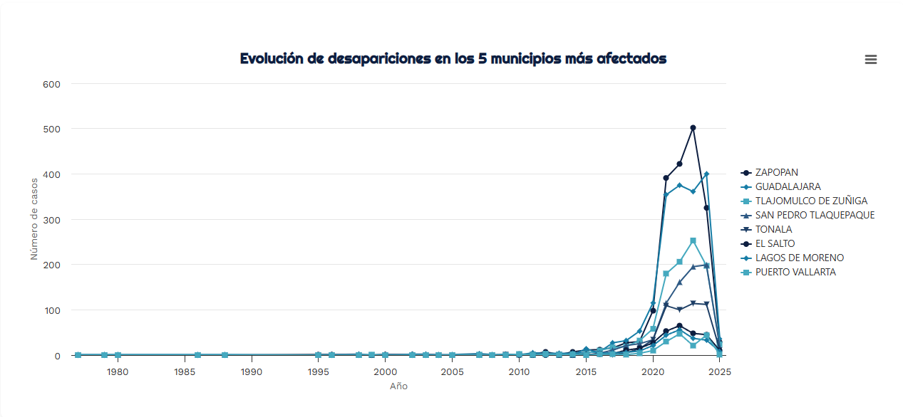

# 📊 Visualización de Desapariciones en Jalisco (2025)

Este proyecto tiene como objetivo visualizar y analizar la evolución de los casos de desaparición en los municipios más afectados del estado de Jalisco, México. A través de representaciones gráficas interactivas y comparativas, se busca comprender mejor la magnitud, el comportamiento temporal y la distribución territorial del fenómeno.

## 🗂️ Contenido del Repositorio

- Gráfico 1: Evolución general de desapariciones por año.
- Gráfico 2: Evolución anual en los 8 municipios más afectados.
- Gráfico 3: Top 8 municipios con mayor número total de casos.

## 📈 Análisis de los Gráficos

### 1. Evolución general de desapariciones por año
Este gráfico muestra un aumento drástico en los casos reportados a partir de 2018, alcanzando un pico entre 2021 y 2023. El comportamiento sugiere una escalada sistemática en la crisis de desapariciones en Jalisco.

### 2. Evolución en los 8 municipios más afectados
Se identifican patrones similares de crecimiento abrupto en los municipios con mayor número de casos. Los municipios más afectados presentan curvas con incrementos particularmente agudos entre 2018 y 2022.

**Municipios analizados**:
- Zapopan
- Guadalajara
- Tlajomulco de Zúñiga
- San Pedro Tlaquepaque
- Tonalá
- El Salto
- Lagos de Moreno
- Puerto Vallarta

### 3. Top 8 municipios con más casos acumulados
Gráfico de barras que muestra los municipios con el mayor número total de desapariciones registradas.

### 3. Comparación por Municipio

| Municipio               | Casos |
|------------------------|-------|
| Zapopan                | 1886  |
| Guadalajara            | 1800  |
| Tlajomulco de Zúñiga   | 1007  |
| San Pedro Tlaquepaque  | 795   |
| Tonalá                 | 507   |
| El Salto               | 281   |
| Lagos de Moreno        | 241   |
| Puerto Vallarta        | 171   |

Este gráfico permite identificar las regiones prioritarias para la atención institucional, en su mayoría concentradas en la Zona Metropolitana de Guadalajara.

## 🧭 Objetivo del Proyecto

El propósito de esta visualización es ofrecer una herramienta accesible que facilite:
- El análisis del fenómeno de desapariciones forzadas en Jalisco.
- La toma de decisiones basadas en evidencia.
- El acompañamiento a procesos de exigencia de justicia y verdad por parte de la sociedad civil.

## ⚙️ Tecnologías Utilizadas

- Python
- Flask 
- Pandas
- Highcharts 
- Jupyter Notebook
- Excel como fuente de datos original
- HTML/CSS
- Jinja2

---
**Autor:** Carlos Eduardo  Salinas Díaz
**Proyecto:** [Ver Proyecto](https://proyecto-visualizacion-2-glxo.onrender.com )
**Contacto:** [LinkedIn](https://www.linkedin.com/in/carlosesalinasdíaz/)
