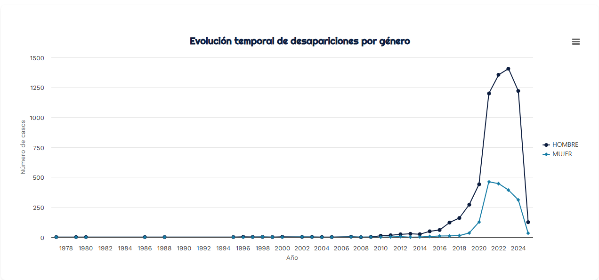
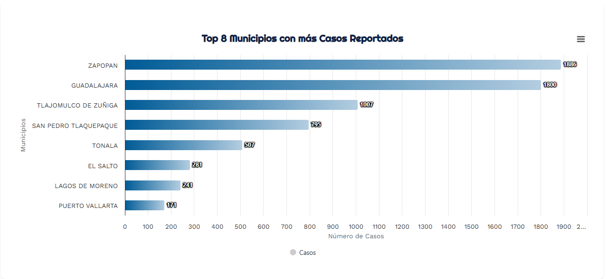

# 📊 Visualización de Desapariciones en Jalisco (2025)

Este proyecto tiene como objetivo visualizar y analizar la evolución de los casos de desaparición en los municipios más afectados del estado de Jalisco, México. A través de representaciones gráficas interactivas y comparativas, se busca comprender mejor la magnitud, el comportamiento temporal y la distribución territorial del fenómeno.

## 🗂️ Contenido del Repositorio
- Base de Datos: Descripción de la base de datos
- Gráfico 1: Evolución general de desapariciones por año.
- Gráfico 2: Evolución anual en los 8 municipios más afectados.
- Gráfico 3: Top 8 municipios con mayor número total de casos.

¡Gracias por recordarlo, Eduardo! Aquí tienes una **descripción clara y profesional de la base de datos** que puedes incluir en tu `README.md` (u otro apartado del proyecto como en la presentación o documentación).

---

## 1. Base de Datos

### 🗂️ Descripción de la Base de Datos

La base de datos utilizada en este proyecto contiene información sobre personas desaparecidas en México, y fue construida a partir de cédulas de búsqueda públicas. 
Se puede consultar [Aquí](https://cartografiadelaausencia.lat/descargables.html).
Cada fila representa un caso individual y cada columna, una dimensión de información relevante para el análisis.

| Campo                                | Tipo de Variable   | Descripción                                                        |
| ------------------------------------ | ------------------ | ------------------------------------------------------------------ |
| **Cédula de Búsqueda**               | Categórica (ID)    | Clave única asignada a cada persona desaparecida.                  |
| **Nombre Completo**                  | Categórica         | Nombre de la persona desaparecida.                                 |
| **Edad al Momento de Desaparición**  | Numérica           | Edad estimada al momento de la desaparición.                       |
| **Fecha de Desaparición**            | Temporal           | Fecha en que se reportó la desaparición.                           |
| **Señas Particulares**               | Categórica (Texto) | Características físicas distintivas proporcionadas por familiares. |
| **Vestimenta**                       | Categórica (Texto) | Descripción de la ropa que llevaba puesta al desaparecer.          |
| **Municipio**                        | Geográfica         | Municipio de Jalisco donde ocurrió la desaparición.                |
| **Estado**                           | Geográfica         | Estado (siempre Jalisco, en este caso).                            |
| **Sexo**                             | Categórica         | Sexo asignado al nacer (femenino o masculino).                     |
| **Género**                           | Categórica         | Identidad de género reportada.                                     |
| **Complexión**                       | Categórica         | Descripción del cuerpo: delgada, robusta, mediana, etc.            |
| **Estatura**                         | Numérica           | Altura estimada en centímetros.                                    |
| **Tez**                              | Categórica         | Tono de piel reportado.                                            |
| **Cabello**                          | Categórica         | Color, forma o características del cabello.                        |
| **Condición de Localización**        | Categórica         | Si la persona ha sido localizada o sigue desaparecida.             |
| **Autorización Información Pública** | Categórica         | Si los familiares autorizaron la publicación de los datos.         |

---

### 📌 Notas sobre la calidad de los datos

* Se identificaron valores nulos en campos como `Señas Particulares`, `Vestimenta`, `Complexión` y `Estatura`, lo cual es común en registros recopilados por familiares.
* La variable `Fecha de Desaparición` se almacenaba inicialmente como tipo `object` y fue transformada a tipo `datetime` para su análisis temporal.
* La limpieza y transformación se realizó utilizando la librería **pandas** en un entorno de Jupyter Notebook para mayor flexibilidad.

---

### ⚠️ Limitaciones de la Base de Datos

A pesar del valor que aporta esta base de datos como herramienta de visibilización y análisis, es importante señalar algunas limitaciones que deben ser consideradas al momento de interpretar los resultados:

1. **Falta de documentación metodológica:**
   Al tratarse de un esfuerzo desarrollado por un colectivo ciudadano, no se cuenta con un documento que detalle la **metodología de recolección**, los **criterios de inclusión/exclusión** ni los **periodos exactos** cubiertos por la información.

2. **Ausencia de normalización en ciertas variables:**
   Campos como `Vestimenta`, `Señas Particulares`, y `Cabello` contienen descripciones textuales abiertas, lo que complica su análisis automatizado o su agrupación por categorías consistentes.

3. **Datos faltantes:**
   Algunos campos clave como `Vestimenta` (con más de 1,600 registros nulos) y `Señas Particulares` presentan valores ausentes. Esto limita la completitud de los perfiles individuales.

4. **Representatividad limitada:**
   La base solo incluye casos que han sido **autorizados por familiares** para ser difundidos públicamente, lo que deja fuera a muchas personas desaparecidas cuyas familias no pudieron o no quisieron proporcionar información.

5. **Alcance geográfico restringido:**
   Aunque algunas variables mencionan el campo “Estado”, todos los registros corresponden al estado de **Jalisco**, por lo que no puede considerarse una base representativa a nivel nacional.

6. **Dimensiones sensibles y potencialmente sesgadas:**
   Categorías como `Género` o `Complexión` pueden estar sujetas a interpretaciones subjetivas por parte de los familiares o quienes documentaron la información.

---

## 📈 Análisis de los Gráficos

### 2. Evolución general de desapariciones por año
Este gráfico muestra un aumento drástico en los casos reportados a partir de 2018, alcanzando un pico entre 2021 y 2023. El comportamiento sugiere una escalada sistemática en la crisis de desapariciones en Jalisco.

### 3. Evolución en los 8 municipios más afectados
Se identifican patrones similares de crecimiento abrupto en los municipios con mayor número de casos. Los municipios más afectados presentan curvas con incrementos particularmente agudos entre 2018 y 2022.

**Municipios analizados**:
- Zapopan
- Guadalajara
- Tlajomulco de Zúñiga
- San Pedro Tlaquepaque
- Tonalá
- El Salto
- Lagos de Moreno
- Puerto Vallarta

### 4. Top 8 municipios con más casos acumulados
Gráfico de barras que muestra los municipios con el mayor número total de desapariciones registradas.

### 5. Comparación por Municipio

| Municipio               | Casos |
|------------------------|-------|
| Zapopan                | 1886  |
| Guadalajara            | 1800  |
| Tlajomulco de Zúñiga   | 1007  |
| San Pedro Tlaquepaque  | 795   |
| Tonalá                 | 507   |
| El Salto               | 281   |
| Lagos de Moreno        | 241   |
| Puerto Vallarta        | 171   |

Este gráfico permite identificar las regiones prioritarias para la atención institucional, en su mayoría concentradas en la Zona Metropolitana de Guadalajara.

## 🧭 Objetivo del Proyecto

El propósito de esta visualización es ofrecer una herramienta accesible que facilite:
- El análisis del fenómeno de desapariciones forzadas en Jalisco.
- La toma de decisiones basadas en evidencia.
- El acompañamiento a procesos de exigencia de justicia y verdad por parte de la sociedad civil.

## ⚙️ Tecnologías Utilizadas

- Python
- Flask 
- Pandas
- Highcharts 
- Jupyter Notebook
- Excel como fuente de datos original
- HTML/CSS
- Jinja2

---

- **Autor:** Carlos Eduardo  Salinas Díaz
- **Proyecto:** [Ver Proyecto](https://proyecto-visualizacion-2-glxo.onrender.com )
- **Contacto:** [LinkedIn](https://www.linkedin.com/in/carlosesalinasdíaz/)
